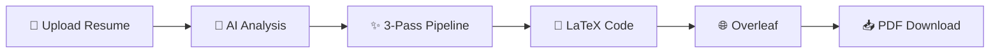
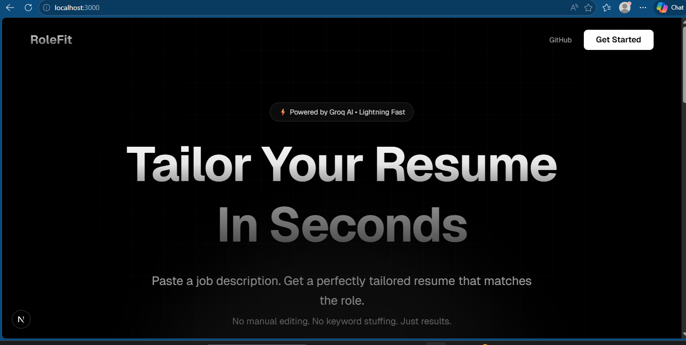
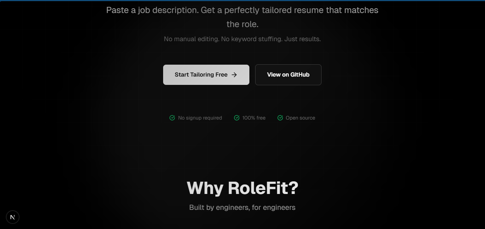
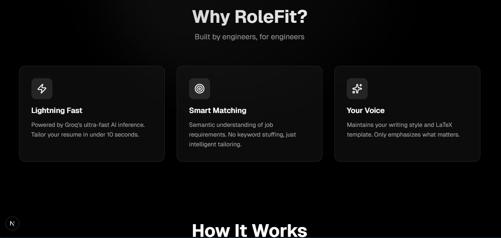
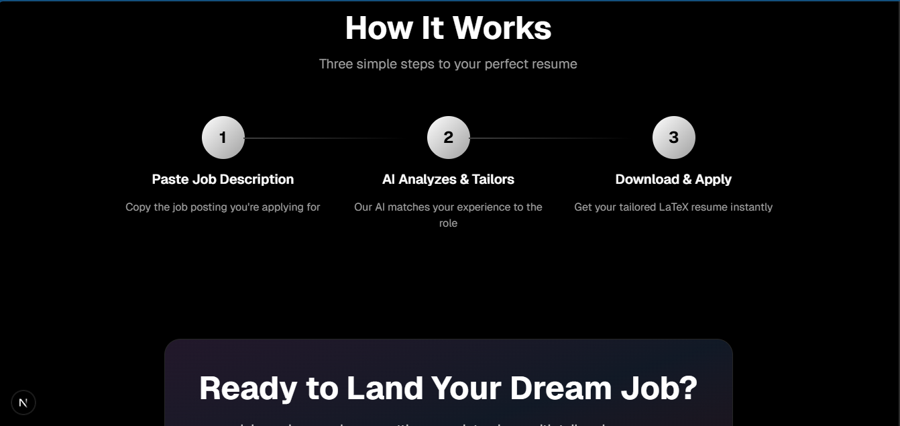
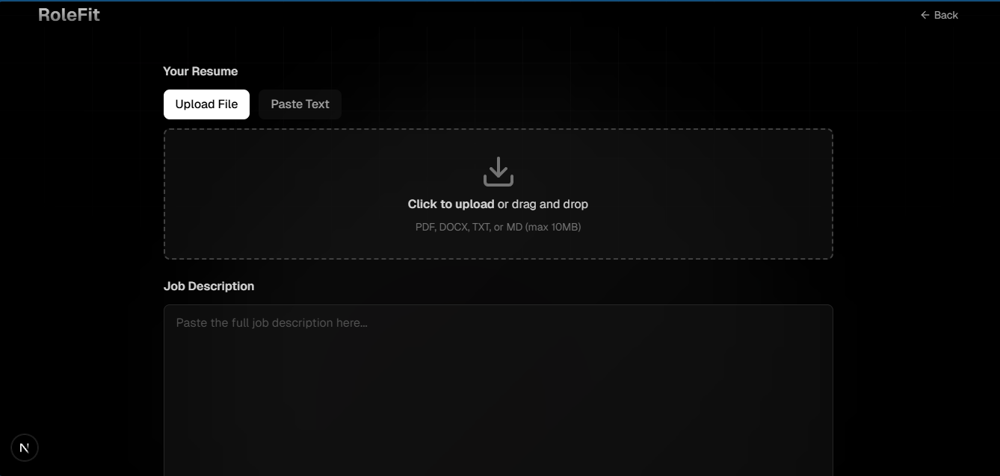

<div align="center">

# 🎯 RoleFit

### AI-Powered Resume Tailoring for Engineers

**Upload resume → Paste job → Get LaTeX → Compile on Overleaf**

[](https://fastapi.tiangolo.com/)
[](https://nextjs.org/)
[](https://groq.com/)
[](https://www.typescriptlang.org/)

[Demo](#-how-it-works) • [Quick Start](#-quick-start) • [Features](#-features) • [API](#-api)

</div>

---

## ⚡ Quick Start

```bash
# 1. Clone and install
git clone <your-repo-url>
cd RoleFit

# Backend
cd backend
python -m venv venv
source venv/bin/activate  # Windows: venv\Scripts\activate
pip install -r requirements.txt

# Frontend
cd ../frontend
npm install

# 2. Configure
cd ../backend
cp .env.example .env
# Add your GROQ_API_KEY to .env

# 3. Run (from root)
dev.bat  # Windows
# Or: Terminal 1: cd backend && uvicorn api_latex:app --reload
#     Terminal 2: cd frontend && npm run dev
```

**Get your free Groq API key:** [console.groq.com](https://console.groq.com)

---

## 🎯 How It Works



### 3-Pass AI Pipeline

1. **Pass 1: Signal Amplification** → Identifies and amplifies technical depth (9/10)
2. **Pass 2: Quality Control** → Enforces conciseness, removes AI patterns (9.5/10)
3. **Pass 3: Signal Injection** → Adds missing technical signals if score < 95 (95+/100)

### What Gets Tailored?

| Section | Action |
|---------|--------|
| **Skills** | ✅ Reordered by relevance + missing skills added |
| **Experience** | ✅ Keywords injected (preserves original tech) |
| **Projects** | ⚪ Unchanged (keeps authenticity) |
| **Education** | ⚪ Unchanged (keeps authenticity) |

---

## 📸 Screenshots

<div align="center">

### Landing Page


### Step-by-Step Workflow

<table>
<tr>
<td width="33%">

**1. Upload Resume**


</td>
<td width="33%">

**2. Paste Job Description**


</td>
<td width="33%">

**3. Get LaTeX Code**


</td>
</tr>
</table>

### Upload Interface


</div>

---

## 🔥 Features

- ⚡ **Lightning Fast** - 3-8 seconds with Groq AI (Llama 3.3 70B)
- 📤 **Multi-Format** - Upload PDF, DOCX, TXT, MD or paste text
- 🎨 **Clean UI** - Minimalist design with Aurora-style gradients
- 🧠 **Smart AI** - Preserves truth, never invents experience
- 📊 **Evaluation** - 5-dimension scoring (technical depth, impact, ATS, authenticity)
- 🌐 **Overleaf Integration** - One-click project creation
- 🔒 **Secure** - API keys in .env, no data stored
- 📱 **Responsive** - Works on desktop, tablet, mobile

---

## 🛠️ Tech Stack

<table>
<tr>
<td valign="top" width="50%">

### Backend
- **FastAPI** - Modern Python web framework
- **Groq AI** - Llama 3.3 70B inference
- **PyPDF2** - PDF text extraction
- **python-docx** - DOCX parsing
- **Python 3.8+**

</td>
<td valign="top" width="50%">

### Frontend
- **Next.js 16** - React framework
- **TypeScript** - Type safety
- **Tailwind CSS 4** - Utility-first styling
- **Lucide Icons** - Beautiful icons
- **Node.js 18+**

</td>
</tr>
</table>

---

## 📁 Structure

```
RoleFit/
├── backend/
│   ├── src/infrastructure/
│   │   ├── ai/                    # Groq client + 3-pass pipeline
│   │   └── parsers/               # Multi-format file extractors
│   ├── templates/
│   │   └── resume_template.tex    # Harshibar-based LaTeX template
│   ├── api_latex.py               # FastAPI server (2 endpoints)
│   └── requirements.txt
│
├── frontend/
│   ├── app/
│   │   ├── page.tsx               # Landing page
│   │   ├── tailor/page.tsx        # Main app
│   │   └── components/ui.tsx      # Reusable UI
│   └── package.json
│
├── dev.bat                         # Start both servers
└── README.md
```

---

## 📡 API

### `POST /api/tailor-latex`
Generate tailored LaTeX code

**Request:**
```bash
curl -X POST <your-api-url>/api/tailor-latex \
  -F "job_description=Senior Full-Stack Engineer..." \
  -F "resume_file=@resume.pdf"
```

**Response:**
```json
{
  "latex_code": "\\documentclass[letterpaper,11pt]{article}...",
  "message": "LaTeX code generated successfully"
}
```

### `POST /api/evaluate-resume`
Evaluate resume quality (5 dimensions)

**Response:**
```json
{
  "total_score": 92,
  "breakdown": {
    "technical_depth": 23,
    "impact_clarity": 18,
    "structure": 19,
    "ats_match": 17,
    "authenticity": 15
  },
  "strengths": [...],
  "weaknesses": [...],
  "critical_fixes": [...]
}
```

### `GET /health`
Health check

---

## 🚀 Deployment

### Backend (Railway/Render)
```bash
# Environment
GROQ_API_KEY=gsk_your_key_here

# Start command
uvicorn api_latex:app --host 0.0.0.0 --port $PORT
```

### Frontend (Vercel)
```bash
# Environment
NEXT_PUBLIC_API_URL=https://your-backend.railway.app

# Auto-detected: Next.js
```

---

## 🧠 AI Philosophy

**Truth First:** Never invents experience, projects, or technologies you haven't used.

**Strategic Enhancement:** Reorders skills, injects keywords, emphasizes relevant achievements.

**ATS + Human:** Optimized for both automated systems and human reviewers.

---

## 📄 License

MIT License - feel free to use for personal or commercial projects.

---

<div align="center">

**Built by engineers, for engineers** 🚀

[⭐ Star this repo](https://github.com/ispastro/RoleFit) • [🐛 Report Bug](https://github.com/yourusername/rolefit/issues) • [💡 Request Feature](https://github.com/yourusername/rolefit/issues)

</div>
